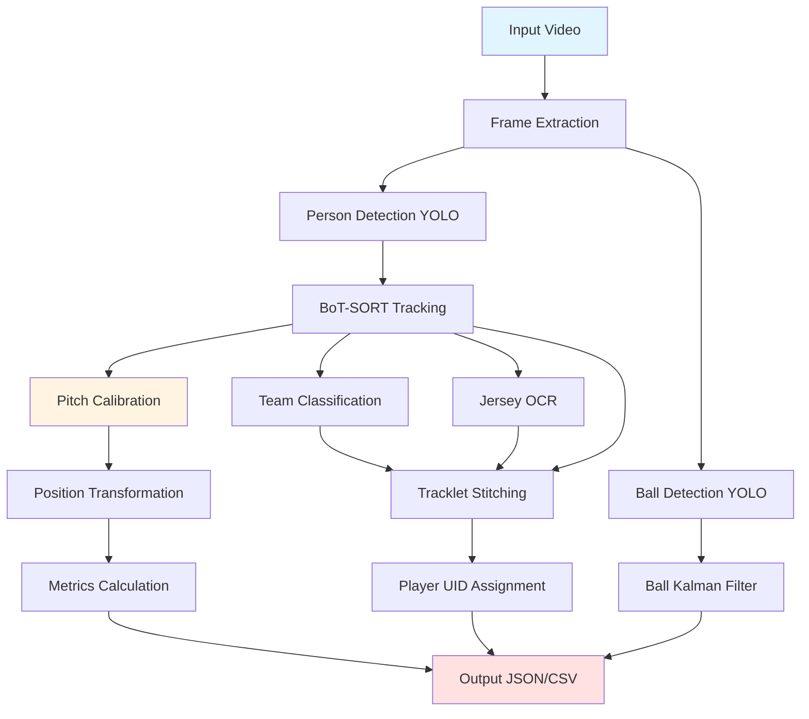

# Pipeline Architecture Design

Computer Vision Pipeline for Soccer Video Analytics - Architecture Overview

---

## System Architecture



---

## Stage-by-Stage Processing

### Stage 1: Video Input & Frame Extraction

**Module**: `cv.pipeline.VideoAnalysisPipeline`

**Input**: 
- Video file (MP4, AVI, MOV)
- Calibration JSON (optional)
- Configuration parameters

**Process**:
1. Open video with OpenCV (`cv2.VideoCapture`)
2. Extract metadata (fps, resolution, frame count)
3. Initialize output directory structure

**Output**: Frame stream for processing

**Performance**: ~30 fps read speed (limited by disk I/O)

---

### Stage 2: Object Detection (Parallel Paths)

#### 2A: Person Detection

**Module**: `cv.tracking.EnhancedTracker`

**Model**: YOLOv8 (ultralytics)
- Classes: `person` (COCO class 0)
- Confidence threshold: 0.3
- NMS threshold: 0.5

**Process**:
1. Resize frame to model input size (640×640 default)
2. Run YOLO inference
3. Filter detections by confidence and class
4. Extract bounding boxes `[x1, y1, x2, y2]`

**Output**: List of person bounding boxes per frame

#### 2B: Ball Detection

**Module**: `cv.ball_tracking.BallTracker`

**Model**: YOLOv8 (fine-tuned or standard)
- Classes: `sports ball` (COCO class 32)
- Confidence threshold: 0.25
- Tiling: SAHI-style slicing for small objects (optional)

**Process**:
1. Tile frame into overlapping crops (if enabled)
2. Run YOLO on each tile
3. Merge detections with NMS
4. Track single ball (highest confidence)

**Output**: Ball bounding box per frame (or None)

---

### Stage 3: Tracking

#### 3A: Person Tracking (BoT-SORT)

**Module**: `cv.tracking.EnhancedTracker` (Ultralytics BoT-SORT)

**Algorithm**: BoT-SORT (GMC + ReID)
- **GMC**: Camera Motion Compensation (ORB feature matching)
- **ReID**: Appearance embeddings (OSNet or similar)
- **Kalman Filter**: 8-state (x, y, aspect_ratio, height, vx, vy, va, vh)

**Process**:
1. Predict next positions (Kalman)
2. Compensate for camera motion (GMC)
3. Match detections to tracks (Hungarian algorithm)
   - Cost: IoU + appearance distance
4. Update matched tracks
5. Initialize new tracks for unmatched detections
6. Delete lost tracks after N frames

**Output**: `track_id` per person bbox per frame

**Fallback**: ByteTrack (simpler, no ReID) via `--tracker bytetrack`

#### 3B: Ball Tracking (Kalman Filter)

**Module**: `cv.ball_tracking.BallTracker`

**Algorithm**: 4-state Kalman filter + speed gating
- **State**: `[x, y, vx, vy]` (position + velocity)
- **Motion model**: Constant velocity
- **Speed gating**: Reject jumps > 35 m/s (126 km/h)
- **Interpolation**: Linear for gaps ≤ 10 frames

**Process**:
1. Predict ball position (Kalman)
2. If detection exists:
   - Check speed plausibility
   - Update Kalman state
   - Mark as `is_detected=True`
3. If no detection:
   - Interpolate if gap small
   - Mark as `is_interpolated=True`

**Output**: Ball position per frame with flags

---

### Stage 4: Team Classification

**Module**: `cv.team_classifier_enhanced.TeamClassifierEnhanced`

**Algorithm**: Per-tracklet KMeans clustering in LAB color space

**Process**:
1. **Color extraction** (first N frames):
   - Crop torso region (middle 50% of bbox vertically)
   - Convert to LAB color space
   - Compute median LAB per observation
2. **Per-tracklet aggregation**:
   - Median LAB across all observations per track
3. **Clustering** (after N frames):
   - KMeans (n_clusters=2) on tracklet medians
   - Optional: Initialize with kit colour priors
4. **Assignment**:
   - Label tracks as Team A or Team B
   - Outlier detection (referee): >1.5 std devs from centers
5. **Goalkeeper detection** (post-fit):
   - Position near goal (<15m from goal line)
   - Colour different from team median

**Output**: Team label (`'A'`, `'B'`, `'referee'`, or `None`) per track

**Limitations**: Sensitive to lighting, torso crop accuracy, colour space choice

---

### Stage 5: Jersey Number OCR

**Module**: `cv.ocr_enhanced.EnhancedJerseyReader`

**OCR Engine**: EasyOCR (default) or PARSeq (pluggable)

**Process**:
1. **Legibility filtering**:
   - Sharpness: Laplacian variance > threshold
   - Contrast: Std dev > threshold
   - Size: Bbox height > 40px
2. **Preprocessing**:
   - Crop torso region
   - CLAHE enhancement (adaptive histogram equalization)
   - Convert to grayscale
3. **OCR inference**:
   - EasyOCR (`readtext()`)
   - Extract digits only (`\d+`)
4. **Confidence-weighted voting** (per tracklet):
   - Accumulate `(number, confidence)` pairs
   - Weighted average or mode
5. **Roster constraints** (optional):
   - Filter by valid jersey numbers per team

**Output**: Jersey number (int or None) per track

**Sampling**: Configurable frame rate (e.g., every 5 frames) to reduce compute

---

### Stage 6: Pitch Calibration & Position Transformation

**Module**: `cv.calibration.PitchKeypointCalibrator`

**Algorithm**: RANSAC homography estimation

**Process**:
1. **Manual or auto keypoint matching**:
   - Image points: Pixel coordinates in video frame
   - Pitch points: Real-world meters (e.g., corner flags)
2. **RANSAC homography**:
   - `cv2.findHomography(..., method=cv2.RANSAC, ransacReprojThreshold=5.0)`
   - Reject outliers beyond 5px reprojection error
3. **Quality metrics**:
   - Inlier count / total points
   - Mean reprojection error
4. **Temporal smoothing** (fixed camera):
   - Exponential moving average of homography matrices
   - Alpha = 0.7-0.9 (smoothing factor)

**Transformation** (per bbox):
1. Compute foot position: `(cx, y2)` where `y2` is bottom of bbox
2. Apply homography: `cv2.perspectiveTransform()`
3. Output: `(pitch_x, pitch_y)` in meters

**Output**: Homography matrix, pitch positions per frame

**Fallback**: If no calibration, physical metrics (speed, distance) are nulled

---

### Stage 7: Tracklet Stitching

**Module**: `cv.tracklet_stitching.TrackletStitcher`

**Goal**: Merge short-term `track_id`s into long-term `player_uid`s

**Algorithm**: Graph matching with cost matrix

**Process**:
1. **Tracklet definition**:
   - Team label (from team classifier)
   - Jersey number (from OCR)
   - Appearance vector (color histogram or embedding)
   - Position trajectory
   - Frame range `[start, end]`
2. **Cost matrix** (pairwise between tracklets):
   ```
   cost(i, j) = w_team * team_mismatch(i, j)
              + w_jersey * jersey_mismatch(i, j)
              + w_appearance * cosine_distance(i, j)
              + w_motion * motion_infeasibility(i, j)
   ```
   - Team mismatch: 0 if same team, ∞ if different
   - Jersey mismatch: 0 if same number, 1 if different, 0.5 if one is None
   - Appearance: 1 - cosine_similarity(color histograms)
   - Motion: 0 if distance ≤ v_max × Δt, ∞ otherwise
3. **Temporal overlap check**:
   - If tracklets i and j overlap in time → cost = ∞
4. **Greedy matching**:
   - Sort tracklets by start frame
   - For each tracklet, find best continuation (lowest cost)
   - Chain tracklets if cost < threshold (e.g., 10.0)
5. **Player UID assignment**:
   - Each chain → unique `player_uid`
   - Record `contributing_track_ids[]`

**Output**: `player_uid` mapping for all tracks

---

### Stage 8: Metrics Calculation

**Module**: `cv.metrics.PerformanceAnalyzer`

**Inputs**: Pitch positions `(x, y, t, is_detected)` per player

#### Distance & Speed

**Process**:
1. Calculate per-frame distances: `d = sqrt((x2-x1)² + (y2-y1)²)`
2. Calculate instantaneous speeds: `v = d / Δt`
3. Smooth speeds: Median filter (window=5 frames)
4. Calculate sustained speeds: Rolling median (window=1s)

**Outputs**:
- `distance_km`: Total distance (km, 3 decimals)
- `distance_m`: Total distance (meters, 1 decimal)
- `top_speed_mph/kmh`: Max sustained speed (detected frames only)

#### Speed Zones

**Zones** (derived from HSR/sprint thresholds):
- Walk: < 7.0 km/h
- Jog: 7.0-15.0 km/h
- Run: 15.0-19.8 km/h (up to HSR threshold)
- HSR: 19.8-25.2 km/h (HSR to sprint threshold)
- Sprint: ≥ 25.2 km/h

**Process** (bug fix 1a):
- Sum actual per-frame distances by instantaneous speed zone
- `zone_X_km = sum(frame_distances where speed in zone_X) / 1000`

**Outputs**: `zone_walk_km`, `zone_jog_km`, `zone_run_km`, `zone_hsr_km`, `zone_sprint_km`

#### High-Intensity Efforts

**HSR bursts**:
- Speed ≥ 19.8 km/h for ≥ 1.0s
- Hysteresis: exit at 90% threshold (17.8 km/h)
- Gap bridging: Drops ≤ 0.2s don't split bursts

**Sprint bursts**:
- Speed ≥ 25.2 km/h for ≥ 1.0s
- Same hysteresis and gap bridging

**Outputs**: `hsr_count`, `sprint_count`, `hi_efforts_count`

#### Accelerations

**Process**:
1. Calculate per-frame accelerations: `a = Δv / Δt`
2. Cap at ±6.0 m/s² (filter impossible jumps)
3. Count high events: |a| > 3.0 m/s² for > 0.7s

**Outputs**: `accel_count_high`, `decel_count_high`

#### Heatmaps

**Process**:
1. Bin pitch positions into grid (21×14 cells default)
2. Count visits per cell
3. Normalize by max count

**Output**: 2D array per player (JSON)

---

### Stage 9: Output Generation

**Module**: `cv.pipeline.VideoAnalysisPipeline`

**Files Generated**:

1. **`tracking_detections.json/csv`**:
   - Frame-by-frame detections
   - Fields: `frame_idx`, `track_id`, `player_uid`, `bbox`, `team`, `jersey_number`, `pitch_x`, `pitch_y`, `is_detected`, `is_interpolated`

2. **`player_match_stats.json/csv`**:
   - Aggregated per-player statistics
   - All metrics from Stage 8

3. **`meta.json`**:
   - Pipeline metadata
   - Fields: `pipeline_version`, `tracker`, `ball_tracking_method`, `calibration_quality`, `speed_preset`, `zone_edges_kmh`, `warnings`

4. **`heatmaps.json`**:
   - 2D heatmap grids per player
   - Only if calibration available

5. **`*_annotated.mp4`** (optional):
   - Annotated video with bboxes, IDs, stats overlay
   - Generated if `--annotate` flag used

---

## Data Flow Summary

```
Video → Frames → Detections → Tracks → Teams/Jerseys → Positions → Metrics → JSON/CSV
                                   ↓
                              Ball Track → Interpolated Positions
                                   ↓
                            Tracklet Stitching → Player UIDs
```

---

## Performance Characteristics

| Stage | Relative Time | Bottleneck |
|-------|---------------|------------|
| Frame Read | 5% | Disk I/O |
| YOLO Detection | 60% | GPU/MPS inference |
| Tracking | 10% | Hungarian matching |
| Team/OCR | 15% | Color extraction, EasyOCR |
| Calibration | <1% | One-time homography |
| Stitching | <1% | Graph matching |
| Metrics | 5% | Distance calculations |
| Output | 5% | JSON serialization |

**Total**: ~5-20 fps on Apple Silicon M1/M2 with yolov8x.pt (varies by video resolution)

---

## Extensibility Points

**Pluggable modules**:
- Tracker: BoT-SORT or ByteTrack
- OCR: EasyOCR or PARSeq
- Team classifier: KMeans or SigLIP embeddings
- Ball model: Standard YOLO or fine-tuned
- Appearance: Color histogram or ReID embeddings

**Configuration**:
- Speed thresholds (HSR, sprint)
- Tracker YAML configs
- Calibration parameters (RANSAC threshold, smoothing)
- OCR sampling rate
- Zone definitions
